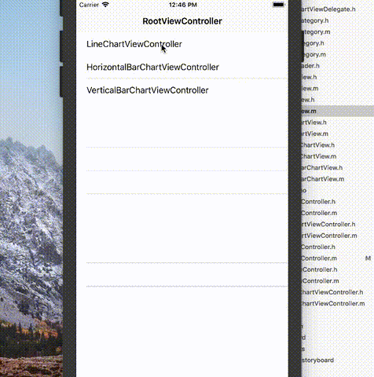

# YHChartView
Charts that support zoom, drag, rotation, animation, including vertical bar, horizontal bar, and line chart. React Native avaliable.

## Cocoapods support
Podfile

```
pod 'YHChartView'
```

## Manual install
```
* download respository<br>
* Objective-C Project: copy 'YHChartView' to your project <br>
* React Native Project: copy 'YHChartView' & 'BIChartModule' (directory: YHChartViewDemoRN/ios/BIChartModule) to your project <br>
```
## Run Objective-C Demo
1. open YHChartViewDemo <br> 
2. run YHChartViewDemo.xcodeproj used by XCode <br>
## Run React Native Demo
1. run command in terminal: cd ${your download directory}/YHChartView-master/YHChartViewDemoRN <br> 
2. run command: npm install <br>
3. run command: npm start <br>
4. run command: open ios <br>
5. run YHChartViewDemo.xcodeproj used by XCode <br>
## Demo
Straight Line Chart <br>
 <br><br>
Curve Line Chart <br>
 <br><br>
Stack Horizontal Bar Chart <br>
 <br><br>
Stack Vertical Bar Chart <br>
 <br><br>
Group Horizontal Bar Chart <br>
 <br><br>
Group Vertical Bar Chart <br>
 <br><br>
## Change logs
### version 0.3.11
1. 折线图UI细节修正 <br>
### version 0.3.10
1. 折线图可以设置起点 <br>
### version 0.3.9
1. bug修复 <br>
### version 0.3.8
1. 重复点击同一个项，取消选中状态 <br>
### version 0.3.7
1. 修改堆叠图的bug <br>
### version 0.3.6
1. 折线图增加曲线连接方式 <br>
2. 折线图选中样式调整 <br>
### version 0.3.5
1. 柱状图两组之间的间隔与柱状图的宽度成正比 <br>
2. 折线图样式调整 <br>
3. 选中效果调整 <br>
4. 分组柱状图增加分割线 <br>
5. 空数据不可被选中 <br>
6. 弹窗样式调整 <br>
7. 标题轴文字区域太小时，不绘制文本 <br>
8. 抽取一个柱状图基类出来；柱状图独有的属性放在柱状图基类中 <br>
### version 0.3.4
1. 废弃version 0.3.3的变更,因为RN代码，单独校验不通过 <br>
### version 0.3.3
1. 增加subspec,用于原生和React Native工程 <br>
### version 0.3.2
1. 增加首次加载动画功能(add animation when load chart firstly) <br>

### version 0.3.1
1. 增加参考线宽及参考线颜色属性(add property: referenceLineWidth, referenceLineColor) <br>
2. fix crash bug: when dividend equal to 0, result is NaN. <br>
3. change rule, which draw circle point in LineChart <br>
4. 增加控制折线图线宽及折线图上圆圈的属性(add  property: lineWidth, circleRadius, circleBorderWidth) <br>
5. 增加控制坐标轴文字大小及颜色的属性(add  property: axisTextFontSize, dataTextFontSize, axisTextColor, dataTextColor) <br>
6. 修改属性hadTapped为可读可写(update hadTapped property) <br>
7. 添加中RN工程中使用YHChartView的demo(add demo, which use YHChartView in React Native Project) <br>


